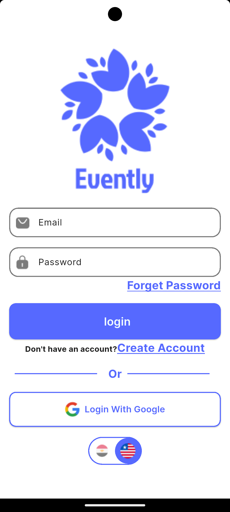
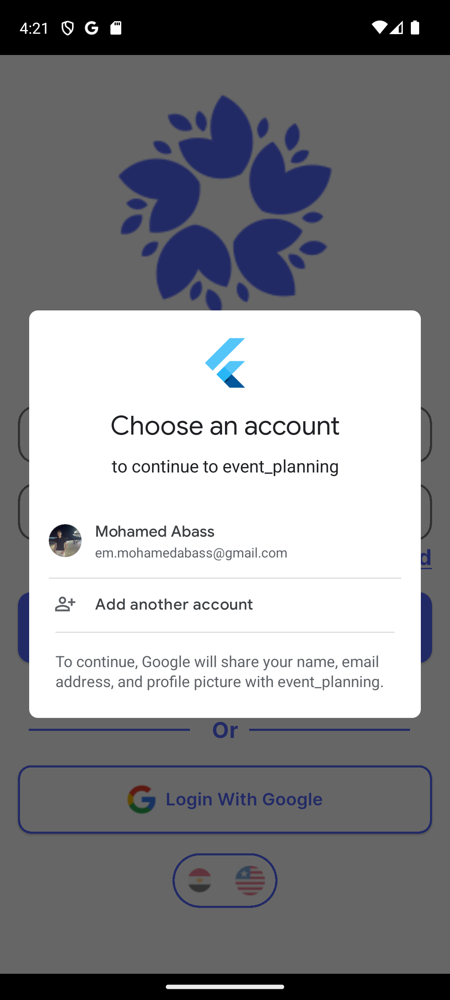
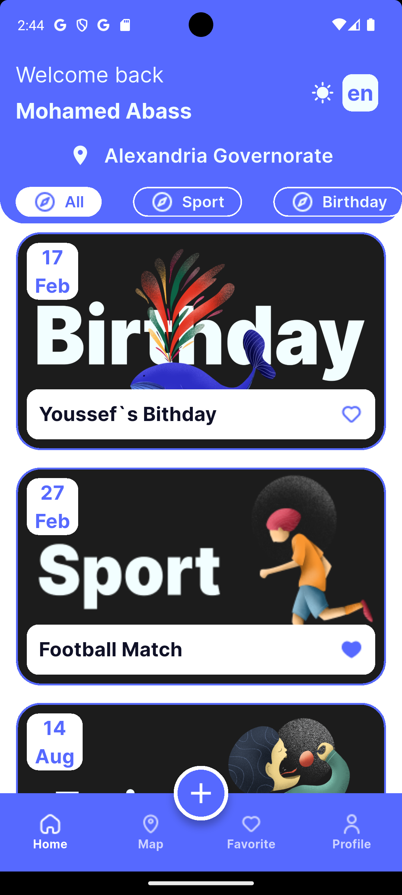
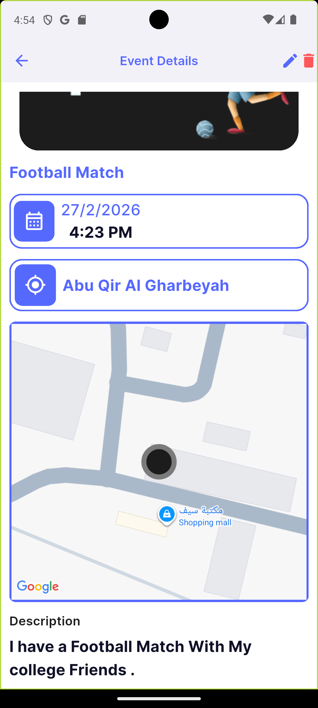
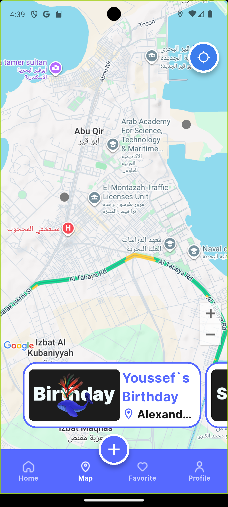
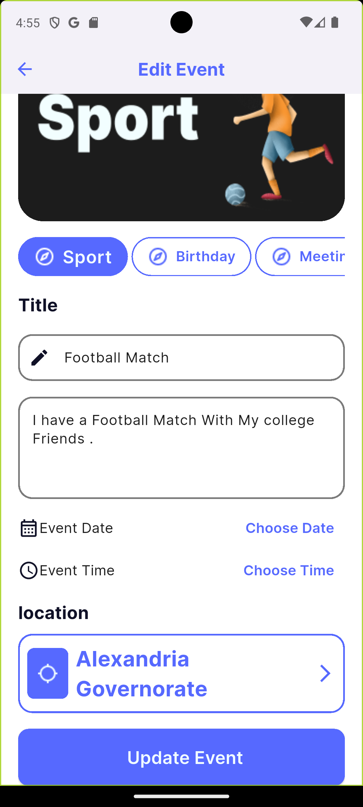
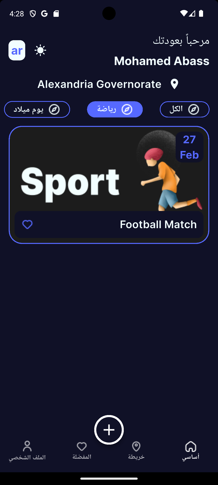

# Evently App
A Flutter application that provides users with a seamless event discovery and organization experience.  
The app allows users to explore events, view details, create their own events, save favorites, and manage their profile — all without requiring an internet connection.

---

## Features
- Discover nearby events
- View event details and locations
- Create and manage personal events
- Save favorite events
- Interactive map for event exploration
- User profile management
- Onboarding experience for new users
- Offline-first design: app works fully without internet
- Persistent local storage for events and preferences

---

## Technologies & Packages
State Management: Bloc, Flutter Bloc, Provider  
Local Storage: Firebase Firestore offline, Shared Preferences  
Location Services: Google Maps, Geolocator, Geocoding, Location  
Connectivity: Connectivity Plus  
Localization: Flutter Localizations, Intl  
UI & Styling: Google Fonts, Animated Toggle Switch, Flutter Toast, Native Splash  
Onboarding: Introduction Screen

---

## Architecture
The project follows Clean Architecture, ensuring scalability, testability, and maintainability:

Presentation Layer → Flutter UI with Bloc/Provider  
Domain Layer → Business logic and use cases  
Data Layer → Repository pattern with local storage

---

## Screenshots

### Main Screens
Login Screen |Google Signin                                 | Home Screen                                         | Event Details
--- |------------------------------------------------|---------------------------------------------| ---
 |  |  | 

### Other Screens
Google Map | Profile Screen                                          | Event Editing                                         | Dark mode-l10n-Theming-Sorting
--- |----------------------------------------------------|-------------------------------------------------| ---
 |  |  | 

---

## About
Evently is a modern Flutter app designed for event discovery and organization.  
It works completely offline, storing all events, favorites, and user preferences locally, providing a smooth and intuitive experience even without an internet connection.
